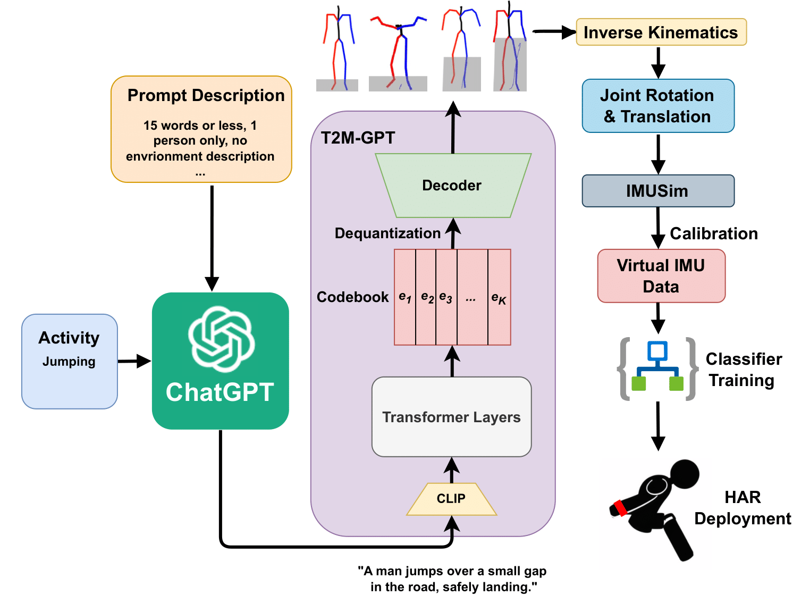

# Generating Virtual On-body Accelerometer Data from Virtual Textual Descriptions for Human Activity Recognition

### [Followup Paper](https://arxiv.org/abs/2402.01049) | [Paper](https://dl.acm.org/doi/10.1145/3594738.3611361)

The development of robust, generalized models for human activity recognition (HAR) has been hindered by the scarcity of large-scale, labeled data sets. Recent work has shown that virtual IMU data extracted from videos using computer vision techniques can lead to substantial performance improvements when training HAR models combined with small portions of real IMU data. Inspired by recent advances in motion synthesis from textual descriptions and connecting Large Language Models (LLMs) to various AI models, we introduce an automated pipeline that first uses ChatGPT to generate diverse textual descriptions of activities. These textual descriptions are then used to generate 3D human motion sequences via a motion synthesis model, T2M-GPT, and later converted to streams of virtual IMU data. We benchmarked our approach on three HAR datasets (RealWorld, PAMAP2, and USC-HAD) and demonstrate that the use of virtual IMU training data generated using our new approach leads to significantly improved HAR model performance compared to only using real IMU data. Our approach contributes to the growing field of cross-modality transfer methods and illustrate how HAR models can be improved through the generation of virtual training data that do not require any manual effort.



If our project is helpful for your research, please consider citing :

```
@inproceedings{Leng2023generating,
author = {Leng, Zikang and Kwon, Hyeokhyen and Ploetz, Thomas},
title = {Generating Virtual On-Body Accelerometer Data from Virtual Textual Descriptions for Human Activity Recognition},
year = {2023},
doi = {10.1145/3594738.3611361},
booktitle = {Proceedings of the 2023 ACM International Symposium on Wearable Computers},
series = {ISWC '23}
}

@article{leng2024imugpt,
      title={IMUGPT 2.0: Language-Based Cross Modality Transfer for Sensor-Based Human Activity Recognition},
      author={Zikang Leng and Amitrajit Bhattacharjee and Hrudhai Rajasekhar and Lizhe Zhang and Elizabeth Bruda and Hyeokhyen Kwon and Thomas Plötz},
      year={2024},
      eprint={2402.01049},
      archivePrefix={arXiv},
      primaryClass={cs.CV}
}
```

## 🚩 News

- [2024/2/1] IMUGPT 2.0 Paper uploaded to Arxiv
- [2023/10/11] **IMUGPT received the Best Paper Honorable Mention Award!** 🏆
- [2023/07/20] **Paper accepted by UbiComp/ISWC 2023!**
- [2023/07/15] Init project
- [2023/05/04] Uploaded Paper to Arxiv

## Installation

Run the follwing code to set up T2M-GPT part of IMUGPT

```bash
conda env create -f environment.yml
conda activate IMUGPT
conda install ipykernel
python -m ipykernel install --user --name IMUGPT
```

When you run the notebooks, make sure to select IMUGPT as the kernel. Else, you might have errors.

You may encounter error when creating the environment, which will cause some packages to not installed. In that case, first manually install the following packages. Then follow the code in the following sections to download all the required components of T2M-GPT. Lastly, install any missing packages when you run into any missing packages error when running the notebooks.

```bash
pip install torch==1.9.1+cu111 torchvision==0.10.1+cu111 torchaudio==0.9.1 -f https://download.pytorch.org/whl/torch_stable.html
pip install git+https://github.com/openai/CLIP.git
pip install gdown
sudo apt update
sudo apt install unzip
```

Tested on Ubuntu 20.04.

## Dependencies

```bash
bash dataset/prepare/download_glove.sh
```

## Motion & text feature extractors:

We use the same extractors provided by [t2m](https://github.com/EricGuo5513/text-to-motion) to evaluate our generated motions. Please download the extractors.

```bash
bash dataset/prepare/download_extractor.sh
```

## Pre-trained models

The pretrained model files will be stored in the 'pretrained' folder:

```bash
bash dataset/prepare/download_model.sh
```

## Imusim Installation

Use the following commands to install imusim

```bash
conda activate IMUGPT
cd imusim
python setup_new.py install
```

## Demo

Use demo.ipynb to verify everything have been installed correctly.

## Workflow

prompt_generation.ipynb -> text_to_bvh.ipynb -> bvh_to_sensor.ipynb -> calibrate.ipynb

In order to run `prompt_generation.ipynb`, you must have an OpenAI API key. Create a file called `api_key.txt`, then put your api key within the txt file as shown below(example uses a fake key).

```bash
api_key=sk-LETcIrgxThV0lSfkLaRBT3BlbkFJMDZoBCPDu4QjCdF
```
