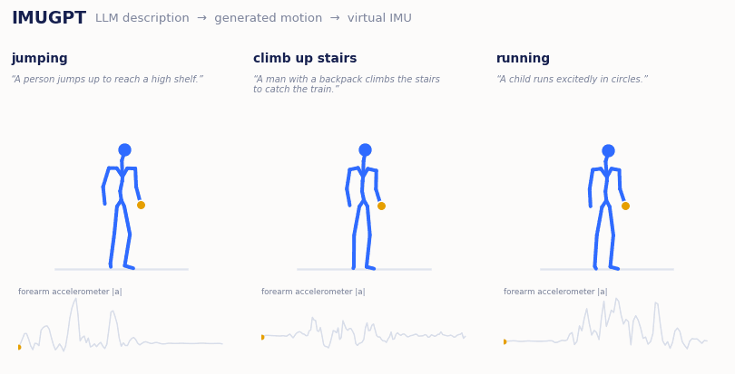
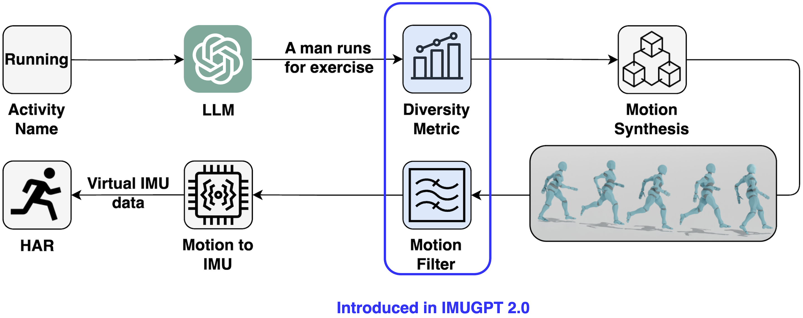
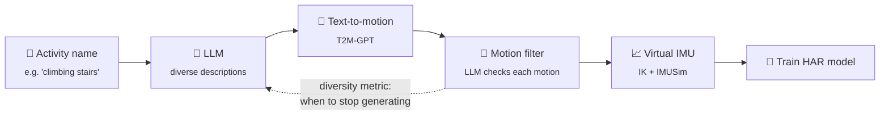

<div align="center">


# IMUGPT

### Describe an activity, generate wearable sensor data

**[Zikang Leng](https://zikangleng.github.io/), Amitrajit Bhattacharjee, Hrudhai Rajasekhar, Lizhe Zhang, Elizabeth Bruda, Hyeokhyen Kwon, [Thomas Plötz](https://ploetzlab.net/)**
<br>Georgia Institute of Technology

[](https://zikangleng.github.io/imugpt/)
[](https://dl.acm.org/doi/10.1145/3678545)
[](https://dl.acm.org/doi/10.1145/3594738.3611361)
[](https://www.ubicomp.org/ubicomp-iswc-2023/awards/ubicomp-iswc-2023-awards/)
<br>
[](https://arxiv.org/abs/2402.01049)
[](https://arxiv.org/abs/2305.03187)



<sub>Generated with IMUGPT: GPT-written activity descriptions → T2M-GPT motion → virtual accelerometer at the forearm (orange dot).</sub>

</div>

**Labelled wearable data is scarce and expensive to collect.** IMUGPT generates it from language:
1. A large language model writes many diverse descriptions of an activity.
2. A text-to-motion model turns each description into 3D human motion.
3. The motion is converted into virtual on-body IMU data that trains human activity recognition (HAR) models.

No cameras or recording sessions are needed.




```mermaid
flowchart LR
    A["💬 Activity name<br/><sub>e.g. 'climbing stairs'</sub>"] --> B["🤖 LLM<br/><sub>diverse descriptions</sub>"]
    B --> C["🕺 Text-to-motion<br/><sub>T2M-GPT</sub>"]
    C --> D["🔎 Motion filter<br/><sub>LLM checks each motion</sub>"]
    D --> E["📈 Virtual IMU<br/><sub>IK + IMUSim</sub>"]
    E --> F["🧠 Train HAR model"]
    D -. "diversity metric:<br/>when to stop generating" .-> B
```

## Papers

| | ACM Digital Library | arXiv |
|---|---|---|
| **IMUGPT 2.0: Language-Based Cross Modality Transfer for Sensor-Based Human Activity Recognition** (IMWUT 2024) | [10.1145/3678545](https://dl.acm.org/doi/10.1145/3678545) | [2402.01049](https://arxiv.org/abs/2402.01049) |
| **Generating Virtual On-body Accelerometer Data from Virtual Textual Descriptions for Human Activity Recognition** (ISWC 2023, Best Paper Honorable Mention) | [10.1145/3594738.3611361](https://dl.acm.org/doi/10.1145/3594738.3611361) | [2305.03187](https://arxiv.org/abs/2305.03187) |

## Highlights

- **IMUGPT (ISWC 2023, Best Paper Honorable Mention)** introduced the language → motion → virtual IMU pipeline. Adding virtual data improved a Random Forest on all three benchmarks:

  | | RealWorld | PAMAP2 | USC-HAD |
  |---|:---:|:---:|:---:|
  | Real only | 0.715 | 0.659 | 0.478 |
  | Virtual only | 0.746 | 0.628 | 0.448 |
  | **Real + Virtual** | **0.770** | **0.699** | **0.486** |

  On RealWorld, the virtual-only model beats the real-only one using under an hour of generated motion.

- **IMUGPT 2.0 (IMWUT 2024)** scales the pipeline to 5 datasets, 5 LLMs, 4 motion-synthesis models and 3 classifiers, and adds two practical extensions:
  - **Motion filter.** An LLM checks whether each generated motion matches its description. The GPT-4 filter cuts incorrect sequences from 35.5% to 9.9%.
  - **Diversity metrics.** Text and motion diversity are strongly correlated (r = 0.87–0.92). Generation can stop once diversity saturates, which saves **at least 50%** of the generation effort without hurting accuracy.

See the [project page](https://zikangleng.github.io/imugpt/) for interactive examples of generated motions, the motion filter and the diversity curves.

## News

- **[2024/09]** IMUGPT 2.0 is published in **IMWUT** (Vol. 8, No. 3).
- **[2024/02/01]** IMUGPT 2.0 paper uploaded to arXiv.
- **[2023/10/11]** IMUGPT received the **Best Paper Honorable Mention Award** at UbiComp/ISWC 2023! 🏆
- **[2023/07/20]** Paper accepted by UbiComp/ISWC 2023.
- **[2023/05/04]** Paper uploaded to arXiv.

## Installation

Set up the T2M-GPT part of IMUGPT:

```bash
conda env create -f environment.yml
conda activate IMUGPT
conda install ipykernel
python -m ipykernel install --user --name IMUGPT
```

When you run the notebooks, select **IMUGPT** as the kernel.

If creating the environment fails and some packages are not installed, install these first. Then download the T2M-GPT components below, and install any remaining packages as the notebooks ask for them.

```bash
pip install torch==1.9.1+cu111 torchvision==0.10.1+cu111 torchaudio==0.9.1 -f https://download.pytorch.org/whl/torch_stable.html
pip install git+https://github.com/openai/CLIP.git
pip install gdown
sudo apt update
sudo apt install unzip
```

Tested on Ubuntu 20.04.

### Dependencies

```bash
bash dataset/prepare/download_glove.sh
```

### Motion and text feature extractors

We use the extractors provided by [t2m](https://github.com/EricGuo5513/text-to-motion) to evaluate generated motions:

```bash
bash dataset/prepare/download_extractor.sh
```

### Pre-trained models

The pretrained models are stored in the `pretrained` folder:

```bash
bash dataset/prepare/download_model.sh
```

### IMUSim

```bash
conda activate IMUGPT
cd imusim
python setup_new.py install
```

## Usage

Use `demo.ipynb` to check that everything is installed correctly. The full workflow is:

```
prompt_generation.ipynb  →  text_to_bvh.ipynb  →  bvh_to_sensor.ipynb  →  calibrate.ipynb
```

`prompt_generation.ipynb` needs an OpenAI API key. Create a file called `api_key.txt` containing your key (never commit this file):

```bash
api_key=sk-...your-key...
```

## Citation

If IMUGPT is helpful for your research, please cite:

```bibtex
@article{leng2024imugpt,
  title     = {IMUGPT 2.0: Language-Based Cross Modality Transfer for Sensor-Based Human Activity Recognition},
  author    = {Leng, Zikang and Bhattacharjee, Amitrajit and Rajasekhar, Hrudhai and Zhang, Lizhe and Bruda, Elizabeth and Kwon, Hyeokhyen and Pl{\"o}tz, Thomas},
  journal   = {Proceedings of the ACM on Interactive, Mobile, Wearable and Ubiquitous Technologies},
  volume    = {8},
  number    = {3},
  articleno = {112},
  year      = {2024},
  doi       = {10.1145/3678545}
}

@inproceedings{leng2023generating,
  title     = {Generating Virtual On-Body Accelerometer Data from Virtual Textual Descriptions for Human Activity Recognition},
  author    = {Leng, Zikang and Kwon, Hyeokhyen and Pl{\"o}tz, Thomas},
  booktitle = {Proceedings of the 2023 ACM International Symposium on Wearable Computers (ISWC '23)},
  pages     = {39--43},
  year      = {2023},
  doi       = {10.1145/3594738.3611361}
}
```

## Acknowledgements

IMUGPT builds on [T2M-GPT](https://github.com/Mael-zys/T2M-GPT), [text-to-motion](https://github.com/EricGuo5513/text-to-motion) and [IMUSim](https://github.com/martinling/imusim). We thank their authors for releasing their code.

## License

The IMUGPT code is released under the [Apache License 2.0](LICENSE). Third-party components keep their own licenses: `imusim/` is GPL-3.0 (see `imusim/license.txt`), and the code adapted from [T2M-GPT](https://github.com/Mael-zys/T2M-GPT) is Apache-2.0.
